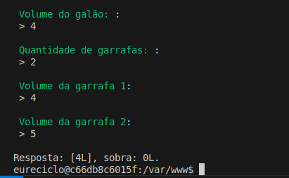
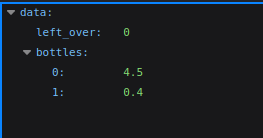

<p align="center"><a href="https://eureciclo.com.br" target="_blank"></a></p>

## Sobre a aplicação

Você acaba de ser contratado para trabalhar em um empresa que realiza a análise de publicações do Diário Oficial da União. Seu objetivo é construir uma API REST que permite realizar o upload de arquivos comprimidos (.zip), e extrair do seu conteúdo os arquivos XML contendo os metadados de cada publicação. Em seguida, você deve disponibilizar os dados extraídos dos arquivos por meio de uma API, mantendo a o lastro com os arquivos originais, bem como a publicação dos dados em um tópico via AMQP.


## 🔧 Ferramentas utilizadas

- Linguagem de programação PHP e o framework Laravel
- Banco de dados: MySql e SQLite
- PestPHP para execução dos testes
- Docker e Docker compose para fazer a configuração do ambiente de desenvolvimento:
    - PHP 8.4
    - RabbitMQ
    - MySql 8
    - PHPMyAdmin

## ⚡️ Configurar a aplicação

Ao colocar a aplicação para rodar, é necessário que as portas 8000, 9000, 3306, 15672 5672 estejam liberadas. A não ser que o docker compose seja alterado.

Na porta 8000 será disponibilizado o servidor WEB da API. Na 3306 temos o MySQL servidor de Banco de dados relacional, 9000 está o PhpMyAdmin para visualização do dados no MySQL, e as portas 15672 e 5672 são para o RabbitMQ, a 5672 comunicação entre backends, e a porta 15672 é o área administrativa do RabbitMQ.

**É necessário ter o docker e docker compose instalado na sua máquina**. Caso não tenha instaldo, [acesse a documentação oficial](https://docs.docker.com/engine/install/) e faça a instalação antes de continuar os passos.


1. Iniciar os containers:
```
docker compose up -d --build
```

2. Entrar no container do app:
```
docker compose exec app bash
```

3. Crie o arquivo .env
```
cp .env.example .env
```

4. Instale as dependências 
```
composer install
```

5. Definir o APP_KEY
```
php artisan key:generate
```

Neste momento, estamos prontos para rodar os testes de unidade e de integração da nossa aplicação. Para isso execute os comandos a seguir:
```
php artisan test
```

adicione *--coverage* no final do comando para exibir a covertura de testes.
```
php artisan test --coverage
```

É possível rodar o comando para fazer a análise de código. Foi utilizado o [Larastan](https://github.com/larastan/larastan).
```
./vendor/bin/phpstan analyse
```

Quando for utilizar a API para importação dos arquivos, primeiro tenha certeza que as ENV do banco de dados e do RabbitMQ estão configuradas:

DB Envs:

```
DB_CONNECTION=mysql
DB_HOST=mysql
DB_PORT=3306
DB_DATABASE=app
DB_USERNAME=root
DB_PASSWORD=root
```

Em seguida, rode as migrations:
```
php artisan migrate
```

RabbitMQ Envs:
```
RABBITMQ_HOST=rabbitmq
RABBITMQ_PORT=5672
RABBITMQ_USER=admin
RABBITMQ_PASSWORD=password
RABBITMQ_VHOST=/
```

## ⚡️ Executar a aplicação

Desafio 1

Para utilizar os recursos da aplicação é necessário disponibilizar o servidor e executar os workers para processamento dos uploads.

Iniciar o servidor WEB:
```
php artisan serve --host 0.0.0.0
```

em outra janela do terminal (primeiro entre no container app novamente: Passo 2): 
```
php artisan queue:work
```

1 - Listar artigos:

GET http://localhost:8000/api/articles?page=1&per_page=10

2 - Importar artigos

POST http://localhost:8000/api/articles/uploads

enviando o arquivo zipado, o nome do atributo no body deve ser file_zip. E foi desenvolvido para receber um arquivo de cada vez.

Ao enviar o arquivo zipado, será feito o registro no DB desse arquivo e em seguida será enviado para um storage, aqui mantive utilizando os próprios drivers do laravel (local e public), eu poderia ter adicionado o MinIO para simular um serviço de storage externo, poderia envolveria mais configurações, e nesta simulação, o storage do póprio laravel é suficiente.

Ao finalizar o upload do arquivo para o storage, será disparado um evento que irá adicionar um Job para extrair os arquivos XML, que ao finalizar a extração dos XML, chamará outro Job para Fazer a extração da publicação da publicação do XML e slvar no DB, bem como notificar o RabbitMQ.

Todos esses processos, inicialmente e pferencialmente são feitos de forma assícrona.

Optei por manter a gestão e armazenamento dos Jobs, usando o banco de dados MySQL, como é uma aplicação de apresentação, não achei necessário adicionar mais serviços, o que temos aqui é suficiente para entender como a feature funciona. Em ambientes produtivos, a utilização do Redis, SQS, ou até mesmo o RabbitMQ, são indispensáveis nesse cenário.


Desafio 2

Para a execução do desafio dois fiz dois exemplos:

1 - utilizando o CLI (Artisan commands)
2 - utilizando um endpoint HTTP


Artisan command:
```
php artisan app:gallon-of-water
```

ao executar a linha acima irá aparecer no terminal inputs solicitando:


Endpoint HTTP

[Fazer um GET no endpoint http://localhost:8000/api/gallon-of-water?volume=4&bottles](http://localhost:8000/api/gallon-of-water?volume=4.9&bottles%5B%5D=4.5&bottles%5B%5D=0.4) 

irá retornar o resultado:


